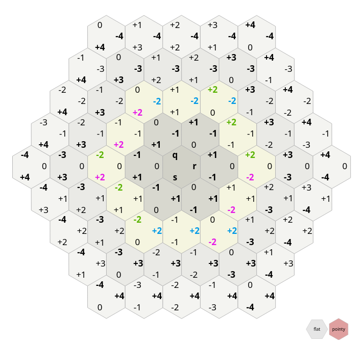
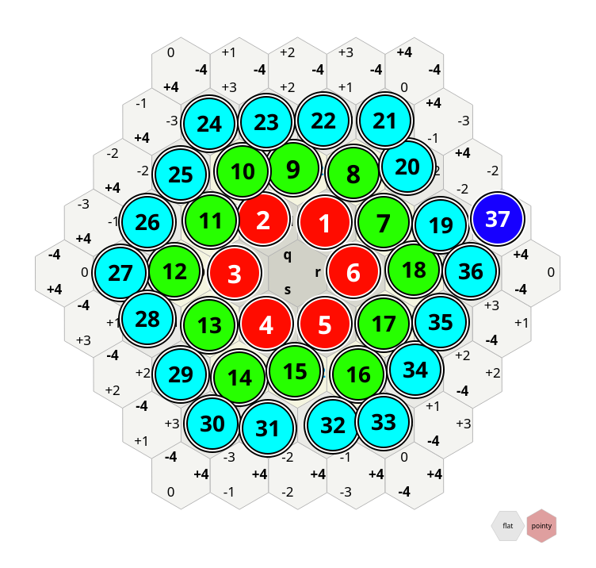

# HexGridSpiral

* A Coordinate System for **hexagonal** maps with support for the usual coordinate-system operations
* Each tile is identified by a  **single unique integer**
* Tile indices start at 0 and **spiral outwards**
* Ideal for e.g. a Level Selection Screen because the level number maps directly to a hex tile without scattering them all over the place.

* My main contribution is **efficiently finding the ring-index** in HexGridSpiral-Space (HGS).

However, most other use-cases benefit greatly from the Cube Coordinates outlined in [this amazing redblobgames article](https://www.redblobgames.com/grids/hexagons/#distances-cube) by Amit Patel. This repo also implements

* Conversion to **Cube Coordinates** for efficient **Neighbour** finding
* A **Distance** between tiles in grid steps
* **Vector Calculus**  
  You can subtract two tiles to get a vector and apply it to a different tile.  You can scale vectors by multiplication.
* A **Euclidean Norm** ([Xiangguo Li 2013](https://www.researchgate.net/publication/235779843_Storage_and_addressing_scheme_for_practical_hexagonal_image_processing))
* Conversion to **Cartesian Pixel Coordinates**
* Rotation by 60 degrees around the origin
* **Addition**, Subtraction of tiles
* Which **Wedge** of the world (pizza slice) a tile is in
* Which Tiles are in **Movement Range** and **Intersecting** Movement Ranges.
* **Reflection** along or acress axes, vertically and horizontally, and diagonally.

## Usage

[crates.io](https://crates.io/crates/hexgridspiral) [documentation](https://docs.rs/crate/hexgridspiral/0.1.0)

Ideally have a look at the code - many features are only implemented on either `HGSTile` or `CCTile`, between which you can convert with `.into()`. `HGSTile` is related to spirals and rings, `CCTile`  has a solid coordinate system to perform arithmetic in.

Here are some ways to **construct** tiles:  

```rust
use hexgridspiral::{CCTile, HGSTile, RingCornerIndex, Ring};
let tile1 = CCTile::unit(&RingCornerIndex::RIGHT);
let tile2 = CCTile::unit(&RingCornerIndex::TOPRIGHT);
assert_eq!(tile1.euclidean_distance_to(&tile1), 0.);

let tile7: CCTile = HGSTile::make(7).into();
let tileo : CCTile = CCTile::origin();
assert_eq!(tile7.euclidean_distance_sq(&tileo), 3);

let corner0_hgs = HGSTile::new(Ring::new(2.into()).corner(RingCornerIndex::BOTTOMLEFT));
```

## Installation

```toml
# Cargo.toml:
[dependencies]
hexgridspiral = { version = "0.1.0", features = ["nightly"] }
```

The feature `nightly` gates some code that only works when compiled with the nightly rust toolchain. Omit it if you need to build in stable rust. (Currently the only thing you lose is ability to iterate over `MovementRange` or some `..=` range between two `TileIndex`.)

### For Development

```bash
git clone git@github.com:lucidBrot/hexgridspiral.git
cd ../your-dependent-project
```

and add to `Cargo.toml` :

```toml
[dependencies]
hexgridspiral = {path = "../hexgridspiral"}
```

## Coordinate Systems

`CCTile` is a pointy-top hex in a system where there are three non-orthogonal axes that always sum up to 1. It is explained very well on [redblobgames.com](https://www.redblobgames.com/grids/hexagons/#distances-cube) (Original image is from there). 

On top of this, we add a spiral system of integers (`HGSTile`).

| Cube Coordinates (`CCTile`)                                  | Hex Grid Spiral (`HGSTile`)     |
| ------------------------------------------------------------ | ------------------------------- |
|  |  |

So for example:

```rust
let tile = CCTile::from_qrs(2, -1, -1);
assert_eq!(tile.spiral_index(), TileIndex(7));
let tile2 = tile.spiral_steps(2);
assert_eq!(tile2.spiral_index(), TileIndex(9));
assert_eq!(tile2, CCTile::from_qrs(1, -2, 1));
```

The spiralling numbers count from zero (at the origin) and count counter-clockwise. In each `Ring`, the maximum number is at the right.

These two coordinate systems use almost exclusively integers. But sometimes you may want to go back to pixel coordinates. For this we have the `.to_pixel`  and `.from_pixel`  functions. The pixel coordinate system x-Axis points to the right and the y-Axis points upwards. If you want the y-Axis to point downwards, you can simply flip the sign.

## Documentation

There is the usual `cargo doc`  documentation. Use `cargo +nightly doc --feature nightly` to see all available docs, including the ones that do not work in stable rust.

I really believe that the function names should already tell what everything does, so as a first step I'd advise you to skim the code for function names you might want to use.

I intend to add examples later on, once I have actually used this crate myself.

## Alternative Crates

I have not used them, but if this crate does not fulfill your needs, there are some others on crates.io. They are unlikely to feature the mapping from spiral indices to cube coordinates, but might have other features that make them stand out. For your convenience, a few links:  

* [hexagonal_pathfinding_astar](https://crates.io/crates/hexagonal_pathfinding_astar)
  * A-Star Pathfinding
* [hexing](https://crates.io/crates/hexing)
  * Hexagonal Bounding Boxes
  * Serialization and Deserialization
* [hexx](https://crates.io/crates/hexx)
  * Conversion from Axial Coordinates to cubic, doubled, hexmod, and offset coordinates.
* [beehive](https://crates.io/crates/beehive)
  * 3D Hexagonal Tiles

## Citing

If you'd like to cite this repo, you can copy-paste this:

```bibtex
@misc{Mink_2024, 
  title={Hexgridspiral}, 
  url={https://github.com/lucidBrot/hexgridspiral},
  journal={GitHub}, 
  author={Mink, Eric Lucidbrot}, 
  year={2024}} 
```

You'll very likely also want to reference the [Red Blob Games Article on Hexagonal Grids](https://www.redblobgames.com/grids/hexagons/#reflection) that informed everything except the spiral part of this implementation.

```bibtex
@misc{Patel_2013,
 title={Hexagonal Grids},
 url={https://www.redblobgames.com/grids/hexagons}, 
 journal={Red Blob Games},
 author={Patel, Amit}, 
 year={2013}, month={Mar}} 
```


