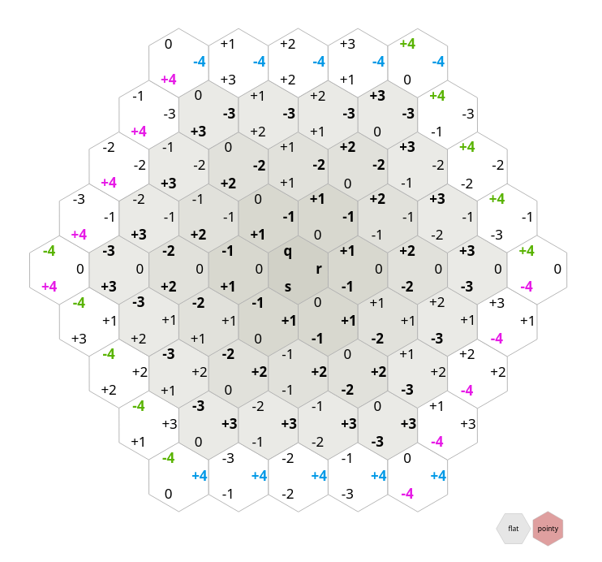

The contents of this `references` folder are not by me and are just for archival should the originals cease beaing accessible.

* [Redblobgames Article on CubeCoordinates](https://www.redblobgames.com/grids/hexagons/#distances-cube) is amazingly well-made, with interactive graphics.
    * 
    * The part on Wedges is [here](https://www.redblobgames.com/grids/hexagons/directions.html)  
* [Xiangguo Li](https://www.researchgate.net/publication/235779843_Storage_and_addressing_scheme_for_practical_hexagonal_image_processing?_sg=flKEA6rk1KmOpC4LBjQJN_-NBuiR1KJtJt-XeYRXnd0z_MNUrB2gjb2FKV3iBoKg988P2xHCpQ) ([DOI](https://doi.org/10.1117/1.JEI.22.1.010502)) provides the background for the euclidean norm computation.
